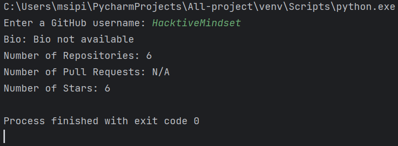
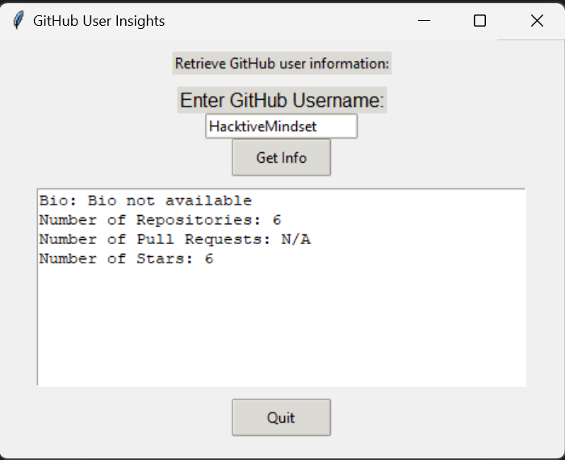

# GitScope - GitHub User Information Retrieval Tool


## CLICK ON FORK THIS REPO

[](https://github.com/HacktiveMindset/GitScope/fork)

GitScope is a Python tool designed to retrieve and display GitHub user information, including bio, repository count, pull requests, and stars. It offers both GUI and CLI options, making it easy to explore GitHub user profiles and save results as personalized text files.

## Table of Contents
- [Introduction](#introduction)
- [Features](#features)
- [Getting Started](#getting-started)
  - [Prerequisites](#prerequisites)
  - [Installation](#installation)
- [Usage](#usage)
  - [GUI Interface](#gui-interface)
    - [How To](#how-to-gui-interface)
  - [CLI Interface](#cli-interface)
    - [How To](#how-to-cli-interface)
- [Results](#results)
- [Discussion](#discussion)
- [Future Enhancements](#future-enhancements)
- [License](#license)
- [References](#references)

## Introduction
GitScope simplifies the process of gathering and analyzing GitHub user insights. Whether you prefer a graphical user interface or a command-line approach, GitScope provides an intuitive way to access valuable GitHub user data.

## Features
- Retrieve GitHub user bio, repository count, pull requests, and stars.
- Choose between a modern GUI interface or a CLI for flexibility.
- Save fetched data as personalized text files for reference.

## Getting Started

### Prerequisites
- Python 3.11
- Required libraries: requests, BeautifulSoup

### Installation

Clone this repository by running the following command in your terminal or command prompt:
   ```bash
   git clone https://github.com/HacktiveMindset/GitScope.git
```
### Navigate to the cloned directory:
```commandline
cd GitScope

```
### Install the required libraries using pip:
```commandline
pip install requests beautifulsoup4

```
## Usage
GUI Interface

Enter the GitHub username in the input field.

Click the "Get Info" button to retrieve user information.

Results will be displayed in the text box. Click "Save Info" to save results as a text file.

### How To (GUI Interface)

Open a terminal or command prompt.

Navigate to the project directory.

Run the following command:
```commandline
python GitScopegui.py

```
Enter the GitHub username when prompted.

Click the "Get Info" button to retrieve user information.

View the results in the text box. Click "Save Info" to save results.

### CLI Interface
Run GitScope.py from the command line.

Provide the GitHub username as an argument:
```commandline
python GitScope.py username

```
# Results
Screenshots and sample outputs :



# Discussion

GitScope's effectiveness in retrieving GitHub user information is discussed in detail in the [Report.txt](Report.txt).

# Future Enhancements
Incorporate graphical data visualization.
Expand support for other version control platforms.

# License

GitScope is licensed under the MIT [LICENSE](https://github.com/HacktiveMindset/GitScope/blob/main/LICENSE)

# References

Python Programming Language. Retrieved from https://www.python.org/

Beautiful Soup Documentation. Retrieved from https://www.crummy.com/software/BeautifulSoup/

Tkinter Documentation. Retrieved from https://docs.python.org/3/library/tkinter.html

GitHub. Retrieved from https://github.com/

Requests Documentation. Retrieved from https://docs.python-requests.org/en/latest/


Additional resources include Stack Overflow, online tutorials, and guides.

## Contact

For inquiries or feedback, please contact

[](https://www.instagram.com/piyush.mujmule)
